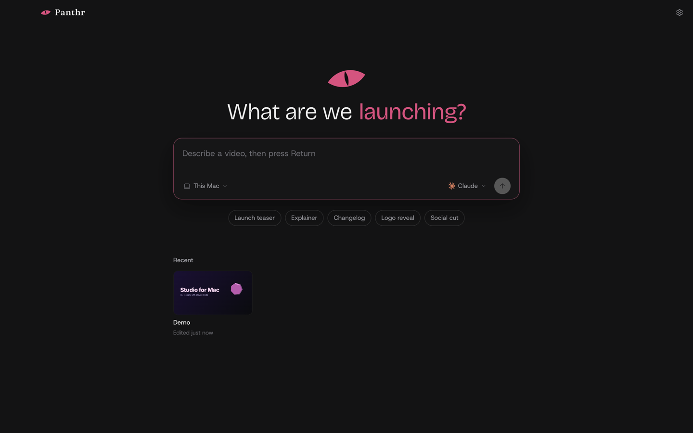
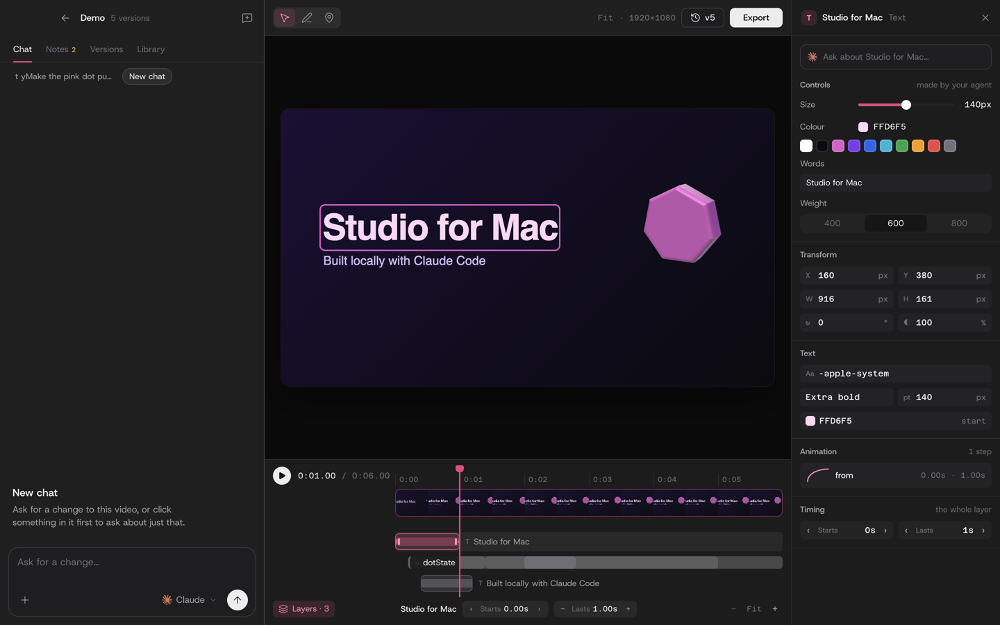

# Panthr

**Panthr by [Clueso](https://www.clueso.io).** Make videos by talking to an agent, on your Mac.

Panthr is a video editor where the editing is done by the coding agent you already use: Claude Code or Codex. You describe the video; the agent writes it as a web page (HTML, CSS and GSAP, played by the [HyperFrames](https://github.com/heygen-com/hyperframes) runtime); you watch it, point at things, nudge them on a timeline, leave notes at moments, and export an MP4.





## What it does

- **Start from an idea.** Type what the video is on Home. Panthr makes a project folder and hands your idea to the agent.
- **A real editor around the agent.** The picture, one timeline with every layer and when it moves, and an inspector for whatever you click.
  - Drag a bar to move a layer and its ends to stretch it.
  - Steps (tweens) can be re-timed and re-eased.
  - Every edit is a plain change to the project's files, and ⌘Z undoes it.
- **Controls made for you.** Ask the agent to "make controls" for an element. It writes sliders, swatches and choices that change the video live as you drag.
- **Point and draw.** Click anything in the video to ask about just that, or draw on a frame and send the marked-up picture to the agent.
- **Notes and versions.** Pin notes to moments or spans of the video, and have the agent fix them all at once. Every export is kept as a version.
- **Skills.** A shared set of agent skills (HyperFrames, GSAP, motion design, explainer videos…) is linked into every project. Add any package from [skills.sh](https://skills.sh) or GitHub.
- **Remote hosts.** Projects can live and run on another machine over SSH, while you use Panthr here. The agent, the page and renders all run there.
- **A command line.** `panthr` drives the app from a terminal, a script or another agent (see below).

## Requirements

- macOS 13 or later on Apple silicon.
- [Claude Code](https://claude.com/claude-code) or [Codex](https://github.com/openai/codex), signed in on this Mac.
- [Node.js](https://nodejs.org) 20 or later (videos are built and exported with it), and `ffmpeg` for posters and frames.

Panthr runs the agent you have, with your own account; it adds no service of its own.

## Build and run

```bash
git clone <this repo> panthr && cd panthr
npm install
npm run dev          # the app, with hot reload
npm test             # the test suite (vitest)
npm run typecheck
npm run dist         # dist/mac-arm64/Panthr.app (ad-hoc: codesign --force --deep -s - dist/mac-arm64/Panthr.app)
```

## The command line

Install it from Settings › About (it links `panthr` into `~/.local/bin`), or run `resources/cli/panthr.mjs` directly. It talks to the running app over a local socket and starts Panthr, out of the way, when it isn't running. What you do there shows in the window.

```bash
panthr new "A 15-second logo reveal with light leaks" --wait   # a project, and the agent at work
panthr chat "Make the title bigger" --wait                       # a change, printed as it happens
panthr note "The logo is too small here" --at 2.5-4              # a note on a span of the video
panthr fix --wait                                                # the agent addresses every open note
panthr export --wait                                             # an MP4, with its path
panthr layers                                                    # what moves when
panthr help
```

Every command takes `-p <name or path>` (default: the project open in the window) and `--json` for output a script can read.

## How it is built

Electron, React and TypeScript, with [electron-vite](https://electron-vite.org).

| Where | What |
|---|---|
| `src/shared/api.ts` | The whole contract between the window and the main process, typed. `methods.ts` lists every method; the compiler keeps the two in step. |
| `src/main/` | One module per part of the API: `projects`, `chats` (with `agents/claude.ts` and `agents/codex.ts`), `controls` (the editor tool), `review` (notes, versions, export, filmstrip), `skills`, `hosts` and `remote`, `files`. Plus `control.ts`, the socket the command line uses. |
| `src/main/preview.ts` | The `panthr://` protocol that serves a project to the preview, with the HyperFrames runtime, the picker and Panthr's bridge injected. |
| `src/renderer/` | The window: Home, the editor (chat, stage, timeline, inspector, panels) and Settings. |
| `resources/` | What ships beside the app: the runtime, `bridge.js`, the picker, the editor tool (`edit.mjs`), the agent's instructions (`studio_prompt.md`) and the CLI. |

Projects live in `~/Panthr/<name>/`. Panthr's notes on each project (chats, notes, controls, versions) are kept in its `.studio/` folder, and settings in `~/Library/Application Support/Panthr/`.

### Testing without a window

A headless run never shows a window:

```bash
PANTHR_SHOT=/tmp/shot.png PANTHR_SHOT_DELAY=4000 \
PANTHR_EVAL="document.querySelector('.tl-layer .tl-bar') !== null" \
npx electron .
```

It renders hidden, runs `PANTHR_EVAL` in the window (and `PANTHR_FRAME_EVAL` inside the video page), saves a capture and quits. Point `HOME` and `PANTHR_DATA_DIR` at a temporary folder to keep it away from your own projects.

### The App Store build

`npm run dist:mas` builds the sandboxed variant (`build/entitlements.mas*.plist`). The sandbox allows the folders the agents and tools need, and `paths.ts` resolves your real home folder inside it. Signing and upload go through Xcode (`xcodebuild -exportArchive`). If you sign by hand, sign `Contents/Resources/resources/bin/panthr-ocr` (the on-screen text reader, rebuilt with `npm run build:ocr`) with the inherit entitlements before the app itself.

## License

[MIT](LICENSE). Panthr bundles third-party work under its own licences; see [NOTICE](NOTICE).

Panthr is made by [Clueso](https://www.clueso.io); the Clueso name and mark belong to Clueso and are not covered by the MIT licence. Claude is a trademark of Anthropic, and OpenAI and Codex are trademarks of OpenAI. Their marks are shown only to name the agent you have chosen; Panthr is not affiliated with either.
